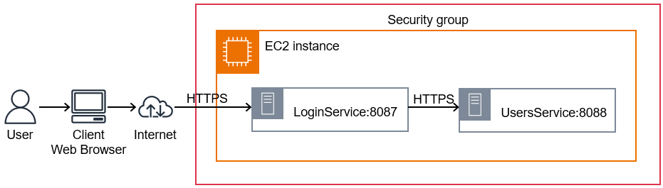
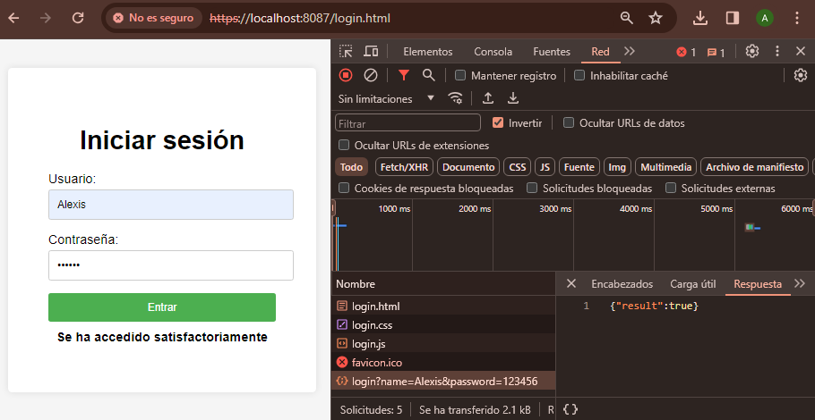
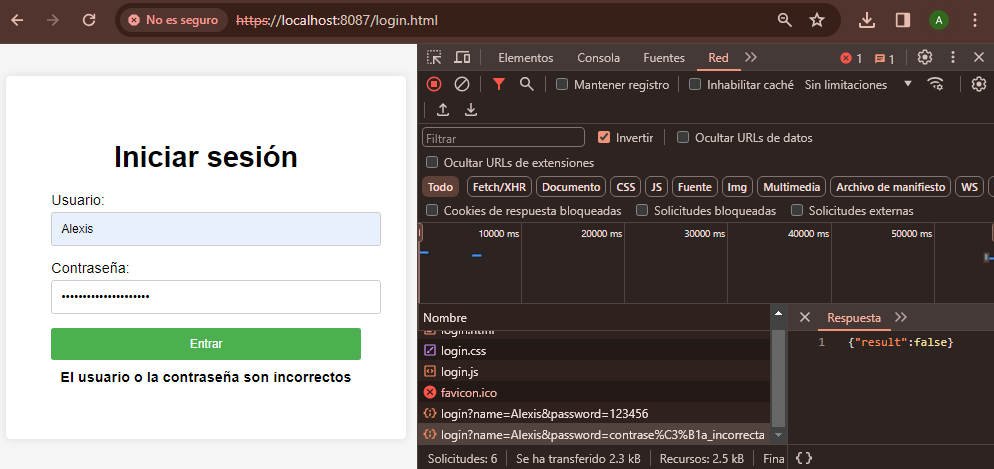
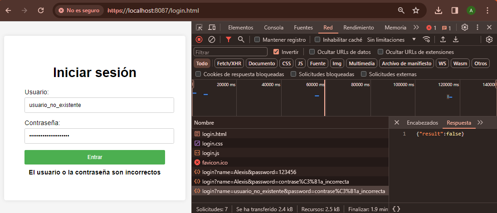
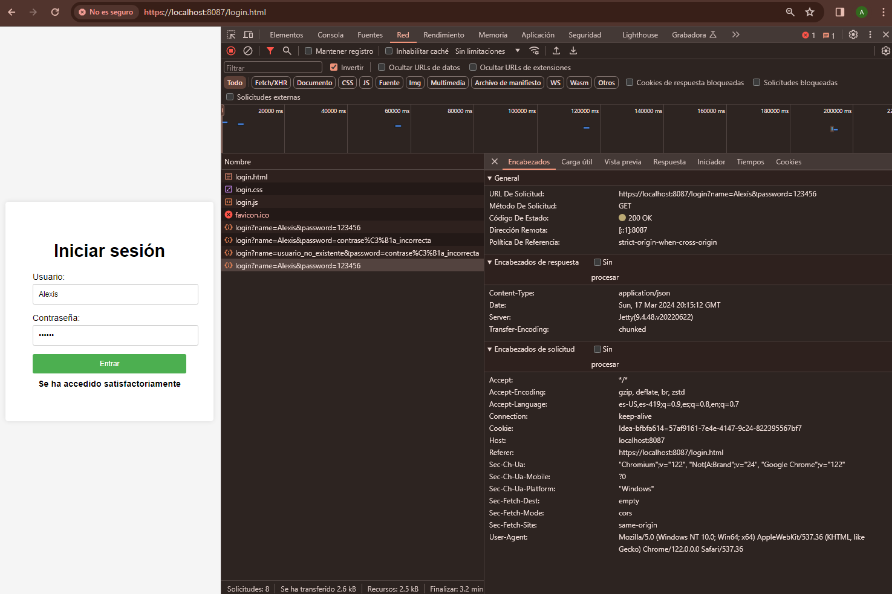

# TALLER 7: APLICACIÓN DISTRIBUIDA SEGURA EN TODOS SUS FRENTES

Este proyecto consiste en el desarrollo de una aplicación web segura. Se garantiza un acceso seguro desde el navegador a la aplicación, asegurando la autenticación, autorización e integridad de los usuarios. Esto se logra mediante el uso de certificados digitales y protocolos de comunicación seguros como HTTPS.

La aplicación consta de al menos dos servicios que se comunican entre sí. La comunicación entre estos servicios garantiza la autenticación, autorización e integridad, asegurando que solo los servicios autorizados puedan invocar a otros servicios. Nadie puede invocar los servicios si no está autorizado.

## Comenzando

Estas instrucciones te ayudarán a obtener una copia del proyecto en funcionamiento en tu máquina local para fines de desarrollo y pruebas.

### Requisitos previos

* Kit de desarrollo de Java (JDK) versión 11 o posterior
* Herramienta de construcción Maven

### Instalar y Ejecutar

1. Clona el repositorio:
    ```
    git clone https://github.com/AlexisGR117/AREP-TALLER7.git
    ```
2. Navega a la carpeta del proyecto:
    ```
    cd AREP-TALLER7
    ```
3. Construye el proyecto usando Maven:
    ```
    mvn clean install
    ```
4. Ejecuta la aplicación, se debe correr tanto LoginService (Puerto 8087) y ServiceFacade (Puerto 8088):
   ```
   java -cp target/AREP-TALLER7-1.0-SNAPSHOT.jar edu.eci.arep.LoginService
   ```
   ```
   java -cp target/AREP-TALLER7-1.0-SNAPSHOT.jar edu.eci.arep.UsersService
   ```
5. Abre un navegador web y accede a la aplicación en http://localhost:8087/login.html.


### Ejecutando las pruebas

Ejecuta las pruebas unitarias:
```
mvn test
```

## Arquitectura

La aplicación sigue una arquitectura basada en servicios, donde se tienen dos servicios principales:

* **LoginService:** Este servicio actúa como un punto de entrada para la autenticación de usuarios. Maneja las solicitudes de inicio de sesión desde el navegador web y realiza la validación de credenciales. Utiliza HTTPS para garantizar la comunicación segura con el cliente.
* **UsersService:** Este servicio se encarga de gestionar los usuarios y sus contraseñas almacenadas de forma segura utilizando hashes. Proporciona una API para verificar las contraseñas de los usuarios. También se comunica de manera segura utilizando HTTPS.

La comunicación entre estos servicios se realiza a través de HTTPS, lo que garantiza la autenticación, autorización e integridad de los datos intercambiados.
La arquitectura se puede representar de la siguiente manera:



Ambos servicios utilizan certificados digitales autofirmados almacenados en un almacén de claves (certificados/ecikeystore.p12) para habilitar la comunicación segura a través de HTTPS. Además, se utiliza un almacén de confianza (certificados/myTrustStore.p12) para validar los certificados de los servicios remotos.

La aplicación está construida utilizando el micro-framework Spark Java y se empaqueta como una aplicación ejecutable utilizando el plugin maven-shade-plugin. Este plugin permite crear un jar autónomo que incluye todas las dependencias necesarias para ejecutar la aplicación.

## Escalar la arquitectura de seguridad para incorporar nuevos servicios

La arquitectura de seguridad implementada en esta aplicación está diseñada para ser escalable, lo que permite incorporar nuevos servicios de manera sencilla y mantener los mismos niveles de seguridad.

Para agregar un nuevo servicio a la arquitectura, se deben seguir los siguientes pasos:

1. **Generar un nuevo par de certificados:** Utilizando la herramienta Keytool de Java, se debe generar un nuevo par de certificados (clave pública y privada) para el nuevo servicio. Estos certificados deben ser almacenados en el almacén de claves compartido.
2. **Configurar el nuevo servicio:** El nuevo servicio debe ser configurado para utilizar los certificados generados en el paso anterior. Esto implica cargar el almacén de claves y habilitar la comunicación segura a través de HTTPS en el código del servicio.
3. **Agregar el certificado al almacén de confianza:** El certificado del nuevo servicio debe ser agregado al almacén de confianza compartido. De esta manera, los demás servicios confiarán en el nuevo servicio durante la comunicación segura.
4. **Actualizar la configuración de los servicios existentes:** Los servicios existentes deben ser actualizados para confiar en el nuevo certificado agregado al almacén de confianza. Esto puede implicar reiniciar los servicios o recargar la configuración de seguridad en tiempo de ejecución.
5. **Establecer la comunicación segura:** Una vez que todos los servicios confían en los certificados mutuamente, se puede establecer la comunicación segura entre ellos utilizando HTTPS.

## Evaluación

### Caso de prueba 1 - Prueba de inicio de sesión exitoso:

**Objetivo:** Verificar que un usuario válido puede iniciar sesión correctamente.

**Entrada:**
* Nombre de usuario: "Alexis"
* Contraseña: "123456"

**Salida esperada:** Se recibe el JSON {"result":true} y se muestra el mensaje "Se ha accedido satisfactoriamente"



### Caso de prueba 2 - Prueba de inicio de sesión fallido:

**Objetivo:** Verificar que un usuario con credenciales incorrectas no puede iniciar sesión.

**Entrada:**
* Nombre de usuario: "Alexis"
* Contraseña: "contraseña_incorrecta"

**Salida esperada:** Se recibe el JSON {"result":false} y se muestra el mensaje "El usuario o la contraseña son incorrectos"



### Caso de prueba 3 - Prueba de inicio de sesión con usuario no existente:

**Objetivo:** Verificar que un usuario que no existe en el sistema no puede iniciar sesión.

**Entrada:**
* Nombre de usuario: "usuario_no_existente"
* Contraseña: "cualquier_contraseña"

**Salida esperada:** Se recibe el JSON {"result":false} y se muestra el mensaje "El usuario o la contraseña son incorrectos"



### Caso de prueba 4 - Prueba de comunicación segura entre servicios:

**Objetivo:** Verificar que la comunicación entre los servicios LoginService y UsersService se realiza de manera segura utilizando HTTPS.

**Entrada:**
* Nombre de usuario: "Alexis"
* Contraseña: "123456"

**Salida esperada:** Verificar que los encabezados de la respuesta incluyen información relacionada con HTTPS.



### Video con las pruebas y los despliegues funcionando

En el video se podrá ver cómo se hizo el despliegue en AWS y las pruebas correspondientes para verificar:
* La instancia de los servicios LoginService y UsersService estén en ejecución.
* LoginService responde con un objeto JSON indicando si la autenticación del usuario fue exitosa o no.
* El cliente web (navegador) tiene un campo para ingresar el nombre de usuario y otro para la contraseña, y un botón para iniciar sesión. Cada vez que el usuario envía las credenciales, el navegador las envía al servicio LoginService y actualiza la pantalla con la respuesta en formato JSON.
* El servicio LoginService implementa una comunicación segura con el servicio UsersService utilizando HTTPS.

## Authors

* Jefer Alexis González Romero
